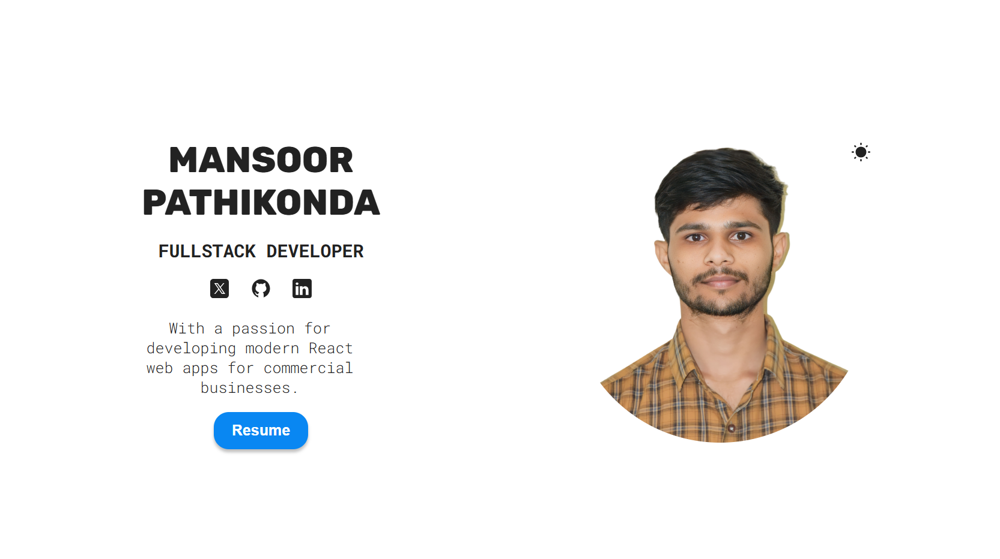

# Mansoor Pathikonda's Portfolio

Welcome to my responsive portfolio! This portfolio showcases my skills, projects, and experience as a software developer.

## Features

- **Responsive Design**: Optimized for various devices, ensuring a seamless experience across desktop, tablet, and mobile.
- **Sections**:
  - **Header**: Includes navigation to different sections of the portfolio.
  - **Hero**: Introduces myself with a brief overview.
  - **Skills**: Highlights my proficiency in various technologies and tools.
  - **Projects**: Displays details of my projects, including descriptions, tech stacks, and live links.
  - **Contact**: Provides ways to get in touch with me.

## Technologies Used

- **Frontend**: React.js, JavaScript, HTML5, CSS3
- **Styling**: Tailwind CSS
- **Deployment**: Netlify

## How to Use

1. **Clone the repository**:
   ```
   git clone https://github.com/Mansoor-P/Portfolio.git
   cd Portfolio
   ```

2. **Install dependencies**:
   ```
   npm install
   ```

3. **Run the application**:
   ```
   npm start
   ```

4. **Access the portfolio**:
   Open your browser and go to `http://localhost:3000`.

## Preview



## Contact Me

- LinkedIn: [Mansoor Pathikonda](https://www.linkedin.com/in/mansoor0731)
- GitHub: [GitHub](https://github.com/Mansoor-P)
- Email: mansoorpathikonda@gmail.com
